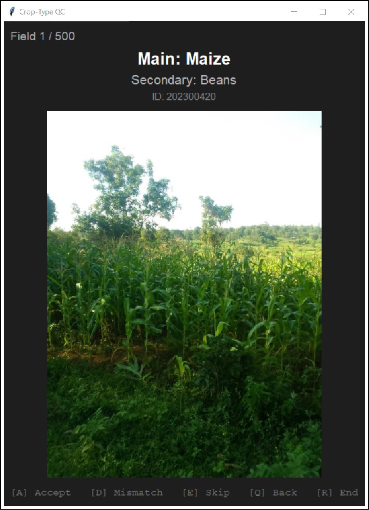

[](https://opensource.org/licenses/Apache-2.0)
[](https://www.python.org/)

This repository provides an overview of the data, tools and scripts to accompany the dataset
publication "[20,000 smallholder crop type and intercropping records for western Kenya, 2023–2025]()".

The paper, outlining the data acquisition, procurement and validation is available [here (TBA)]().<br>
The dataset is available on Zenodo: [https://doi.org/10.5281/zenodo.20268110](https://doi.org/10.5281/zenodo.20268110).

## Table of Contents

- [Background](#background)
- [The Dataset](#the-dataset)
- [Data processing](#data-processing)
- [The field-QC-tool (GUI)](#the-field-QC-tool-GUI)
- [Funding](#funding)
- [Citation](#citation)
- [License](#license-)

### Background
Crop-type maps are essential for agricultural monitoring, yield prediction, and climate adaptation. 
Although remote sensing enables large-scale crop mapping, accurate classification models still 
depend on locally collected ground-truth data. Such datasets are abundant in Europe and North 
America but remain scarce in many regions of the Global South.

This repository accompanies a field survey dataset collected in western Kenya between 2023 and 2025.
Across five seasonal campaigns, locally trained enumerators mapped more than 20,000 smallholder 
fields, including field boundaries, main and secondary crops (intercropping), and field photographs
during the long and short rain seasons. The dataset is intended to support remote sensing research 
and crop classification in smallholder agricultural systems.
<br>

### The Dataset 
The dataset comprises five subsets corresponding to the five seasonal campaigns, each containing
the canonical geopackage with field geometries, crop-types and auxiliary attributes defined in the 
readme file, as well as a "*_QC.gpkg" that contains additional attributes from thematic and geometric
validation.

The main attributes: *field_id, crop_main, crop_sec, growth_main, growth_sec, photo, timestamp, area_acres*
are standardized across all subsets, while auxiliary attributes may differ between subsets.
```text
── data/
│   ├── LRS23     # Long Rain Season 2023   (n=1159)
│   ├── SRS23     # Short Rain Season 2023  (n=1479)
│   ├── LRS24     # Long Rain Season 2024   (n=3408)
│   ├── LRS25     # Long Rain Season 2025   (n=6678)
│   └── SRS25     # Short Rain Season 2025  (n=8265)
```


### Data processing
The data has undergone preprocessing and technical validation. Code for reproducibility and targeted
filtering of the field data is provided. 

The data processing steps include:
- photo anonymization (done manually, no code needed)
- data cleaning and attribute harmonization 
- thematic validation using the field-QC-tool (see below)
- geometric validation (done manually in QGIS, no code needed)
- statistics summarization and overview of validation results 

### The field-QC-tool (GUI)
The field-QC-tool is a basic graphical user interface (GUI) developed for thematic validation and 
relabeling. For each field the photo, field ID and the primary and secondary crop types are displayed. 

The user can accept or change the primary or secondary crop type according to the photo. 
If a photo is not conclusive, the field can be skipped.



The tool generates a checkpoints gpkg to track progress across sessions.

run_qc function parameters are as follows:

| Parameter | Type | Default | Description                                             |
|-----------|------|---------|---------------------------------------------------------|
| `gdf` | `GeoDataFrame` | – | GeoDataFrame containing photo filenames and attributes  |
| `image_col` | `str` | – | Column name with image file paths or names              |
| `crop_col` | `str` | – | Column name for primary crop type                       |
| `sec_crop_col` | `str` | – | Column name for secondary crop type (intercropping)     |
| `image_dir` | `str \| Path` | – | Directory path where field photos are stored            |
| `id_col` | `str \| None` | `"field_id"` | Column name used as unique field identifier             |
| `flag_col` | `str` | `"qc_flag"` | Output column for QC flags (accepted, changed, skipped) |
| `qc_crop_main_col` | `str` | `"qc_crop_main"` | Output column for validated primary crop type           |
| `qc_crop_sec_col` | `str` | `"qc_crop_sec"` | Output column for validated secondary crop type         |
| `reviewed_col` | `str` | `"qc_reviewed"` | Output column indicating whether a field was reviewed   |
| `max_image_size` | `tuple[int, int]` | `(800, 600)` | Maximum display size (width × height) in px             |
| `checkpoint_path` | `str \| Path \| None` | `None` | Path for saving/resuming QC progress checkpoint         |
| `n_samples` | `int \| None` | `None` | Number of fields to review; `None` reviews all          |
| `random_seed` | `int \| None` | `None` | Seed for reproducible random sampling                   |
| `stratify_col` | `str \| None` | `None` | Column used for stratified sampling across categories   |


## Funding
This work was funded by the German Space Agency at DLR via the German Federal Ministry of Economic Affairs 
and Climate Action under Grant 50EE2303A.  We gratefully acknowledge support through the F.R.S.-FNRS
Grants T.0154.21 and 1.B422.24 and the DescartesLabs© platform for enabling access to Airbus© SPOT 6/7 data.


## Citation
Please cite the accompanying paper and Zenodo sources:

TBA 

<br>

## License 
This project is licensed under the **Apache 2.0** License - see the [LICENSE](LICENSE.txt) file for details.
The data is licensed under the **Creative Commons Attribution 4.0 International (CC BY 4.0)** License. 
Refer to Zenodo for more details. 